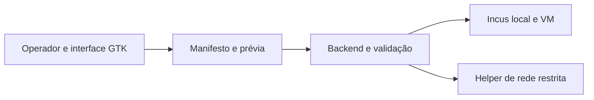

<div align="center">

# LOCKDOWN
### IsolateVM · gestão local e revisável de máquinas virtuais Incus

[](https://github.com/Walc21/LOCKDOWN/actions/workflows/ci.yml)


**Crie e administre VMs Ubuntu cloud com permissões explícitas, uma prévia antes das mudanças e evidência verificável do que foi testado.**

</div>

> **Estado:** versão 0.3.11. O CI valida código, testes com mocks e Squid, interface GTK sob Xvfb e construção do pacote. Fluxos Incus reais foram exercitados em um host específico na revisão 0.3.10; as correções posteriores de auditoria passaram por testes automatizados, sem nova validação live completa. Veja [o registro de validação](docs/LIVE-VALIDATION.md).

## Visão geral

O **IsolateVM** é a aplicação desktop do repositório LOCKDOWN. Sua interface GTK4/libadwaita funciona como usuário comum; o backend valida manifestos e usa o Incus local para criar VMs Ubuntu, consultar o estado efetivo e executar operações enumeradas. A configuração inicial não compartilha rede, pastas, dispositivos nem segredos do host por padrão.

Ele ajuda um operador a revisar **o que será solicitado ao Incus**. A proteção efetiva também depende das permissões Incus, da configuração do host e do software executado dentro da VM. O aplicativo não é uma fronteira de segurança contra quem já administra o Incus.

### Mapa rápido



| Área | Capacidade | Condição importante |
| --- | --- | --- |
| Criação | Wizard, manifesto YAML, cloud-init e VM criada parada | Apenas imagens Ubuntu cloud e recursos disponíveis no Incus local |
| Ciclo de vida | Start/stop, snapshots, clone, backup e ações de fechamento | Exclusão e restauração exigem confirmação e verificação de propriedade |
| Armazenamento | Mounts RO/RW, cópia única, `/workspace` separado e volumes de dados | Snapshots e backups da VM não incluem volumes customizados separados |
| Rede | Offline, normal, restrita por proxy e LAN-only por CIDR | Rede normal não filtra domínios; LAN-only não foi validada em uma LAN real |
| Segredos | Referências no manifesto e entrega explícita ao `/run` do guest | Valores não são copiados automaticamente do host nem protegidos de root no guest |
| Interface | Prévia de alterações, configuração efetiva, métricas e terminal VTE | O terminal inicia um shell como root **dentro da VM** |

## Começar

No Ubuntu, instale as dependências da interface:

```bash
sudo apt install python3 python3-gi python3-yaml python3-secretstorage \
  gir1.2-gtk-4.0 gir1.2-adw-1 gir1.2-vte-3.91
```

Explore a interface sem conectar ao Incus:

```bash
ISOLATEVM_MOCK=1 python3 -m isolatevm
```

Para operar VMs reais, configure antes o daemon, o projeto, o pool e a bridge Incus apropriados ao seu host; depois execute `python3 -m isolatevm` como usuário comum. **Não abra a interface com `sudo` ou `pkexec`.** A instalação do aplicativo não inicializa Incus nem concede grupos privilegiados automaticamente.

O pacote Ubuntu é construído a partir do checkout:

```bash
./scripts/build-deb.sh
dpkg-deb --contents dist/isolatevm_0.3.11_all.deb
```

O `.deb` gerado fica em `dist/` e não é commitado no Git. Consulte [empacotamento](PACKAGING.md) antes de instalá-lo, especialmente se usar egress restrito.

## Modos de rede e perfis

| Escolha | Comportamento |
| --- | --- |
| `offline` | Sem NIC Incus. É a configuração inicial e a única rede aceita pelo perfil `maximum-isolation`. |
| `normal` | Usa uma bridge Incus escolhida; o IsolateVM não aplica filtro por domínio. |
| `restricted` | Regras explícitas de domínio, IP ou CIDR e porta TCP passam por um proxy por VM e regras nftables. Conexões diretas e DNS do guest são bloqueados. |
| `lan-only` | Usa o mesmo caminho restrito, aceitando CIDRs privados IPv4 e portas TCP declarados. Não comprova que o CIDR seja a LAN pretendida. |

O helper de egress é separado da GUI e exige autorização Polkit para as operações previstas. A restauração do firewall antes do daemon Incus é parte do desenho; **reboot físico do host ainda não foi validado** nesta revisão. O [modelo de segurança](SECURITY.md) explica DNS, destinos especiais, falhas e limites da política.

## Dados e operações

- **Cópia única:** arquivos escolhidos entram no disco do guest após o primeiro start; não criam um mount contínuo nem sincronizam mudanças posteriores.
- **Compartilhamento:** mounts RO/RW são explícitos e aparecem na revisão. Prefira RO quando a VM não precisar escrever no host.
- **Persistência:** `persist-workspace` restaura o disco da VM no fechamento normal e conserva um volume Incus independente em `/workspace`. Exporte esse volume separadamente.
- **Alterações:** antes de aplicar CPU/RAM, mounts, rede, dispositivos ou crescimento do disco raiz, a interface compara o estado Incus efetivo com a prévia e recusa uma prévia obsoleta.
- **Software opcional:** ferramentas de coding e DevOps são instaladas no guest. Tokens, arquivos de login e configuração do host não são transferidos automaticamente.
- **Auditoria local:** o histórico tem limite de 16 MiB, lock entre escritores e aviso quando não pode registrar um evento. É um registro operacional do usuário, não uma trilha inviolável.

## Evidência e limites

| Evidência disponível | Fora da comprovação desta versão |
| --- | --- |
| CI em Ubuntu 24.04: suíte com testes GTK via Xvfb, integração Squid sintética, compilação e construção `.deb` | Reboot físico com políticas ativas |
| Exercícios locais documentados em Ubuntu 26.04.1, Incus 6.0.5 e VMs Ubuntu 24.04, incluindo egress restrito e fluxos de armazenamento | LAN-only em uma rede real; passthrough físico USB/GPU/PCI |
| Testes automatizados posteriores para auditoria concorrente, escrita parcial e log cheio na interface | Login desktop interativo e autenticação live das CLIs de IA; quota de 1 GiB em outros backends |

Esses resultados descrevem ambientes e condições específicos. Consulte [o registro detalhado](docs/LIVE-VALIDATION.md) antes de usar uma função que dependa de integração física, rede ou privilégios do host.

## Documentação

| Documento | Assunto |
| --- | --- |
| [Arquitetura](ARCHITECTURE.md) | Componentes, fluxos e fronteiras de confiança |
| [Segurança](SECURITY.md) | Modelo de ameaças, controles, riscos residuais e egress |
| [Manifesto v1](docs/MANIFEST.md) | Campos, limites, rede, software e ciclo de vida |
| [Validação](docs/LIVE-VALIDATION.md) | Evidência automatizada, live, inspecionada e ainda pendente |
| [Desenvolvimento](DEVELOPMENT.md) | Ambiente, testes e contratos de implementação |
| [Empacotamento](PACKAGING.md) | Construção, instalação e integração opcional com o host |
| [Histórico de versões](CHANGELOG.md) | Mudanças e escopo da release |

## Desenvolvimento e testes

```bash
python3 -m pytest -q
ISOLATEVM_UI_TEST=1 xvfb-run -a python3 -m pytest -q
python3 -m compileall -q isolatevm packaging/isolatevm-egress-helper.py packaging/guest
```

O CI executa esses testes sem acessar um daemon Incus real. Os procedimentos que criam VMs são separados e estão descritos em [DEVELOPMENT.md](DEVELOPMENT.md).
